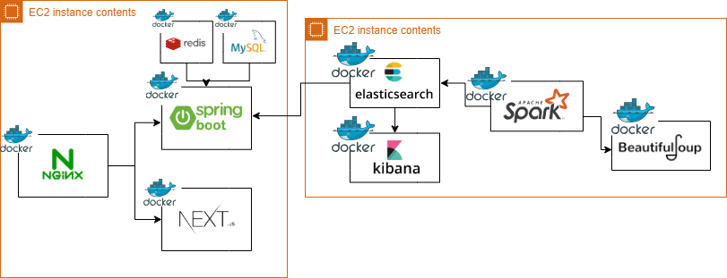
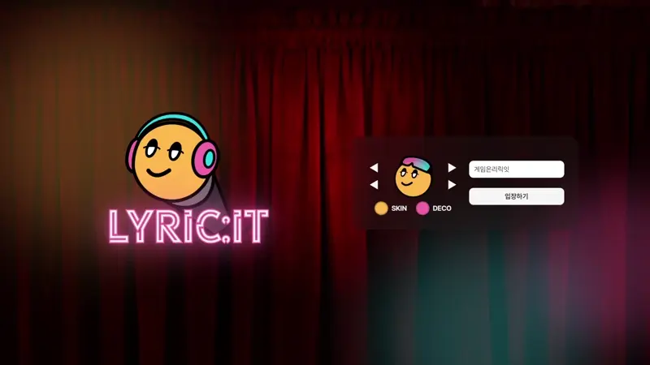
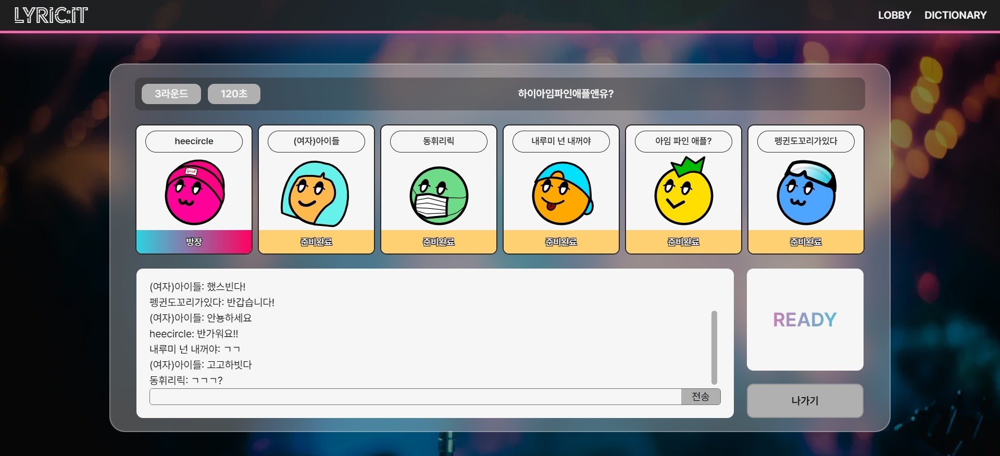

  

---

## 📚 TOC

- [DATA TEAM](#🤝-data)
- [ROLE](#🙋‍♂️-role)
- [DEPLOY URL](#🕊️-deploy-url)
- [SPECIFICATION](#📝-specification)
- [INTRODUCTION](#📢-introduction)
- [SKILLS](#🛠️-skills)
- [SYSTEM ARCHITECTURE](#🌐-system-architecture)
- [SERVICE LAYOUT](#🏠-service-layout)
- [DATA COLLECTION POLICY](#💿-data-collection-policy)

 

---

## 🤝 Data

|  |  |
| :--------------------------------------------------------------------------------------------------: | :----------------------------------------------------------------------------------------------------: |
|                                [용희원](https://github.com/heecircle)                                |                                [박세정](https://github.com/sejeong-park)                                 |

---

## 🙋‍♂️ Role

### 용희원

- 팀 리더
- 음악 가사 크롤링
- Docker를 활용한 Spark 환경 구축
- Spark를 활용한 분산처리 진행
- 한국어 토크나이징을 통한 제시어 추출
- [FE] 음악 가사 사전 페이지 개발

### 박세정

- Docker를 활용한 Elastic Search 클러스터 구축
- Elastic Search Custom analyzer를 통한 검색어 성능 개선
- 음악 차트 데이터 크롤링
- 게임 결과 모달 컴포넌트 개발 및 스토리북 작성
- 사전 페이지 컴포넌트 개발 및 스토리북 작성
- [BE] 음악 가사 사전 API 구축

---

## 🕊️ Deploy URL

- ✅ front-server : https://dev.lyricit.site
- ✅ back-server : https://api-dev.lyricit.site
- ✅ back-swagger : https://api-dev.lyricit.site/swagger-ui/index.html

 

---

## 📝 Specification

- notion : https://takealook97.notion.site/lyricit-b33c49f68e194e3692008dc9b8839c68

 

---

## 📢 Introduction

### main-service

- **LYRIC:IT (리릭잇)**
- 노래 가사 기반 게임 서비스
- 채팅 기능을 통해 웹 기반의 인터렉티브한 소통형 게임을 즐길 수 있다.
- 가사 데이터를 전처리하여 단어 별 빈도를 기준으로 랜덤 키워드를 라운드마다 제시한다.
- 키워드가 포함된 가사를 입력한뒤, 해당 가사를 포함하는 곡의 제목과 가수를 입력한다.
- 정답을 맞추면 라운드마다 선착순 별로 차등된 점수를 획득한다.

### sub-service

- 가사 키워드 데이터 사전 검색 기능

 

---

## 🛠️ Skills

### language

- Python 3.6

### ELK

- Elasticsearch 8.12.2
- Kibana 8.12.2

### Spark

- Pyspark 3.5.1

### Processing

- Beautifulsoup 4.12.3
- Numpy 1.26.4
- Pandas 2.2.1
- Konlpy 0.6.0

### CI/CD

- AWS EC2
- Docker, Docker Hub, Portainer
- Nginx Proxy Manager

 

---
## 🌐 System Architecture

 

 

---

## 🏠 Service Layout

|  |  |
| :--------------------------------------: | :--------------------------------------------------------: |
|                Main Page                 |                           Lobby                            |

|  |  |
| :-----------------------------: | :-----------------------------: |
|              Room               |              Game               |

|  |  |
| :---------------------------------------: | :-------------------------------------: |
|              Correct Answer               |              Wrong Answer               |

|  |  |
| :-------------------------------: | :-----------------------------------: |
|              Result               |              Dictionary               |

---

## 💿 Data Collection Policy

- Lyricit에 사용되는 데이터 정보는 **melon 월간 차트 데이터**와 **금영 차트 데이터**를 사용합니다.
    - 가수, 제목, 가사 정보를 수집합니다.
    - melon 차트는 `1990년 1월 ~ 2024년 3월`까지 월간 차트를 수집합니다.
    - 금영 차트는 `2018년 1월 ~ 2024년 3월`까지 장르별 발라드, 댄스, R&B, 힙합, 락, 동요/만화의 월간 차트를 수집합니다.
- 차트 데이터 기반으로 **Spotify search API**를 사용하여 수집한 데이터를 재가공합니다.
    - 가수와 제목 기준으로 앨범 사진, 1분 미리 듣기 등 기타 정보를 수집합니다.
- 수집한 정보는 다음 목적으로 이용됩니다.
    - 사전 기능을 통한 노래 가사 조회
    - 가사, 제목, 가수명의 일치 여부 게임 서비스 제공
- 차트 Top 100 기준으로 데이터를 수집하므로, 추가적인 음악 정보가 필요하다면, `yhw991228@naver.com` 로 문의 부탁드립니다.